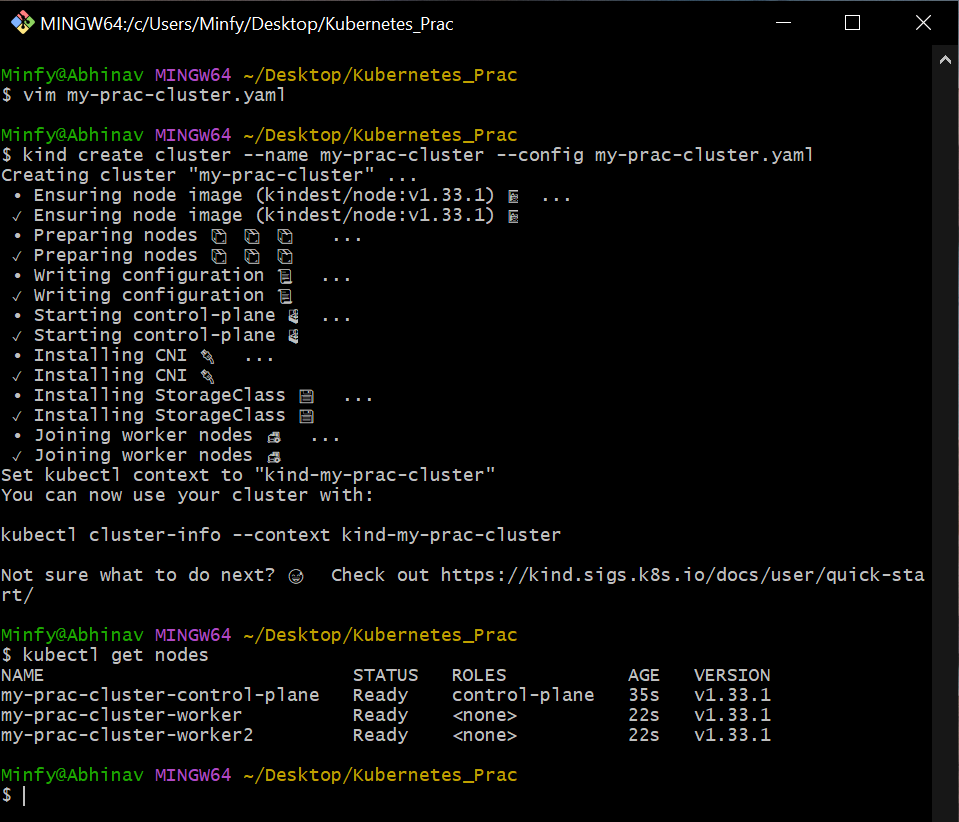
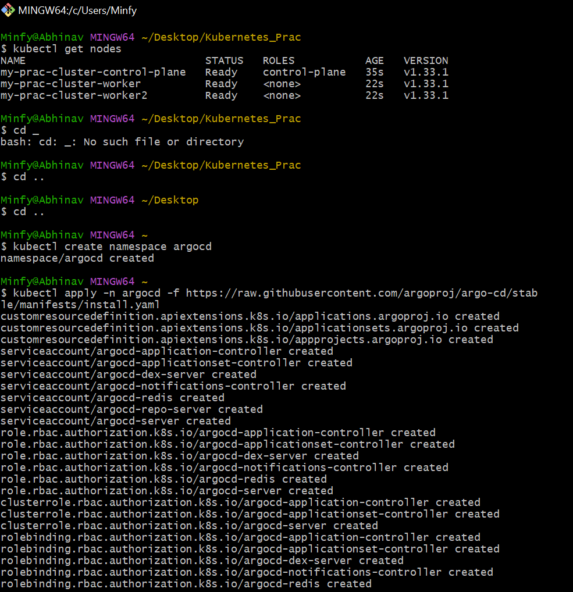
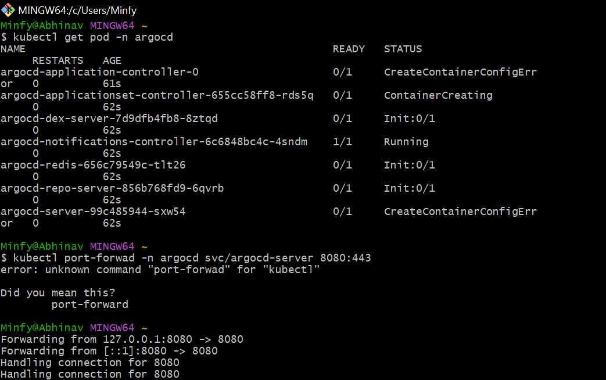
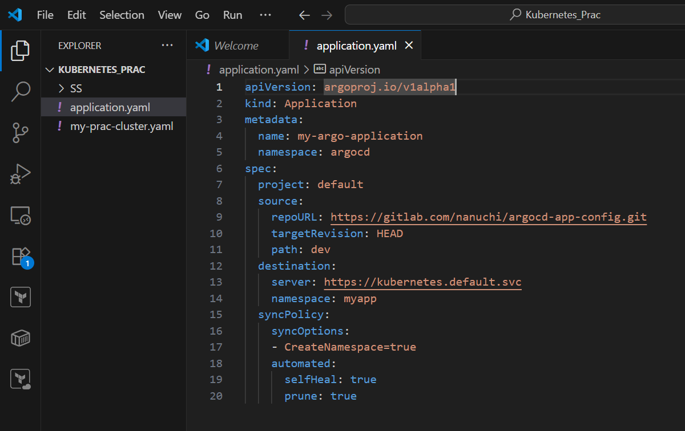
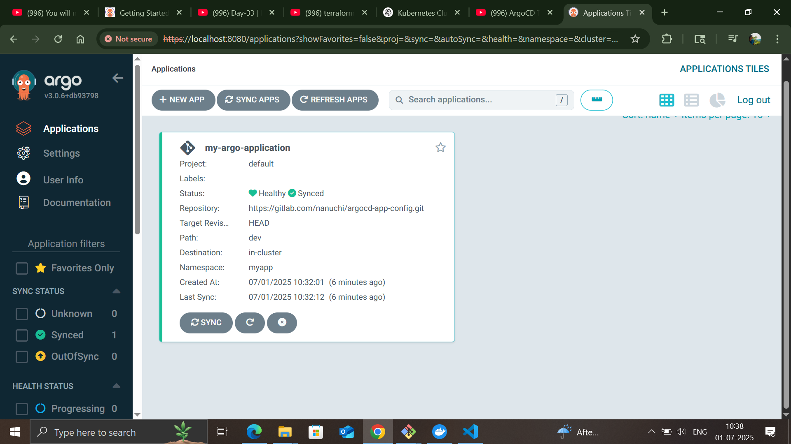

# 🚀 ArgoCD Setup using Kind

This guide outlines the steps for setting up **ArgoCD** on a local Kubernetes cluster using **Kind** (Kubernetes in Docker).

---

## 🛠️ Class Work Overview

### 📌 1. Creating Cluster using Kind  

---

### 📌 2. Creating Namespace  

---

### 📌 3. Port-forwarding to Access ArgoCD UI  

---

### 📌 4. ArgoCD YAML Configuration  

---

### 📌 5. Working ArgoCD Dashboard  

---

## ✅ Summary

- 🔧 **Kind** was used to create a lightweight local Kubernetes cluster.  
- 📁 **Namespaces** were created for isolating ArgoCD resources.  
- 🌐 **Port-forwarding** enabled local access to the ArgoCD UI.  
- ⚙️ **ArgoCD YAML** applied for installation and configuration.  
- 📊 Successfully accessed and used the **ArgoCD dashboard**.

---

## 📚 References

- [ArgoCD Official Documentation](https://argo-cd.readthedocs.io/)
- [Kind - Kubernetes IN Docker](https://kind.sigs.k8s.io/)
