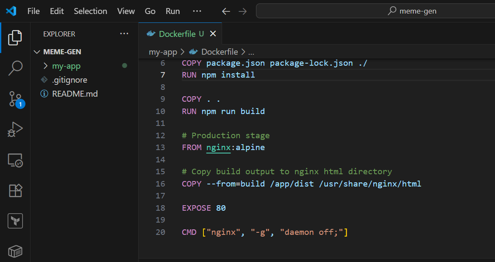
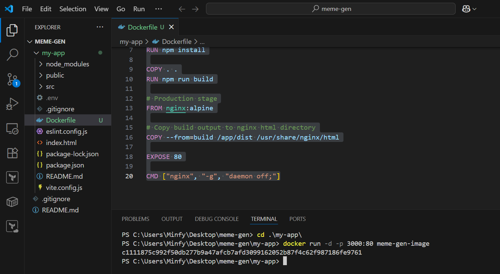
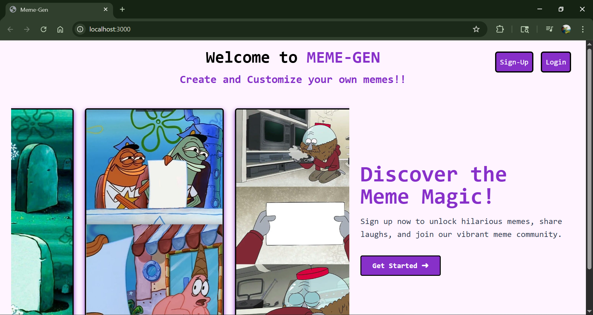
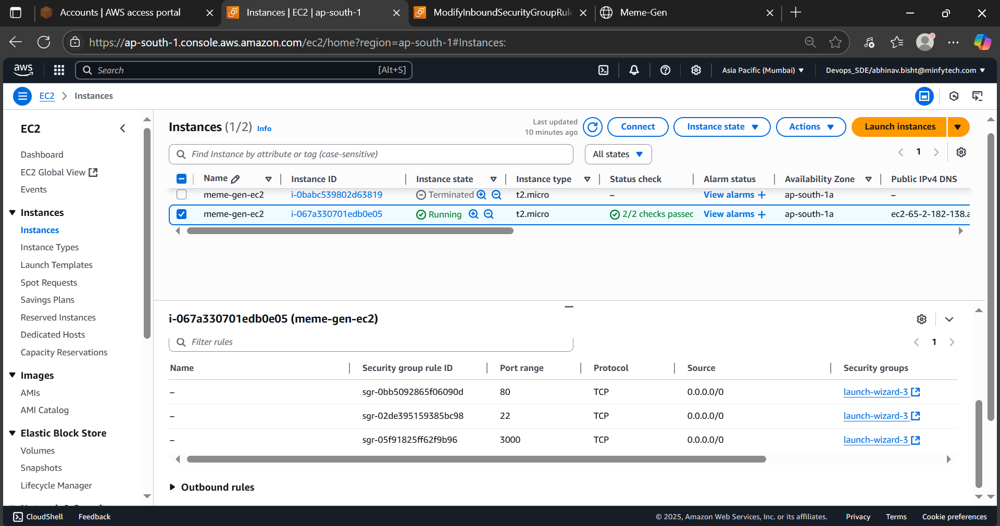
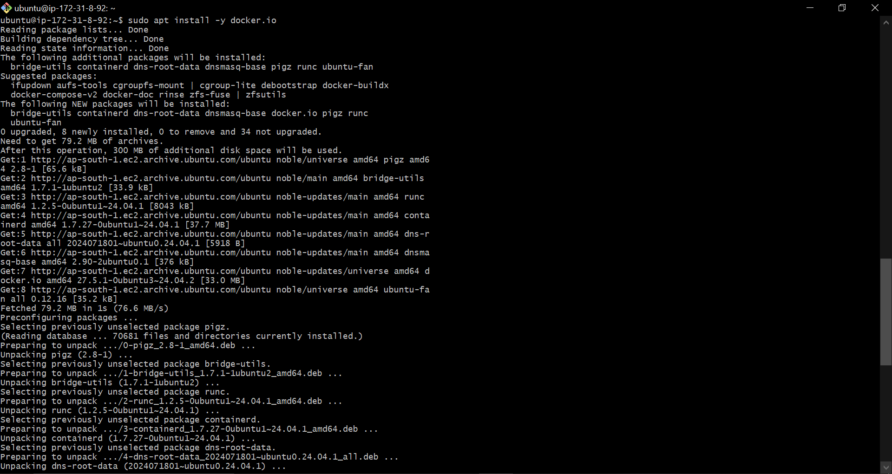
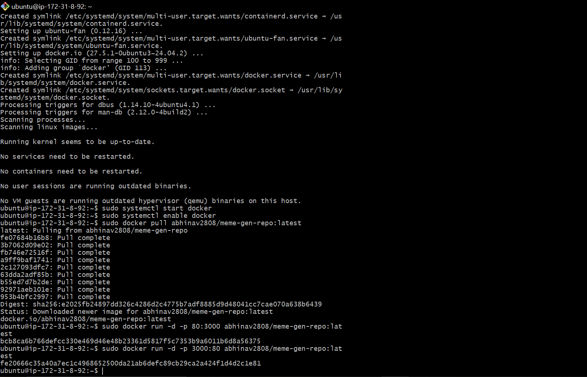
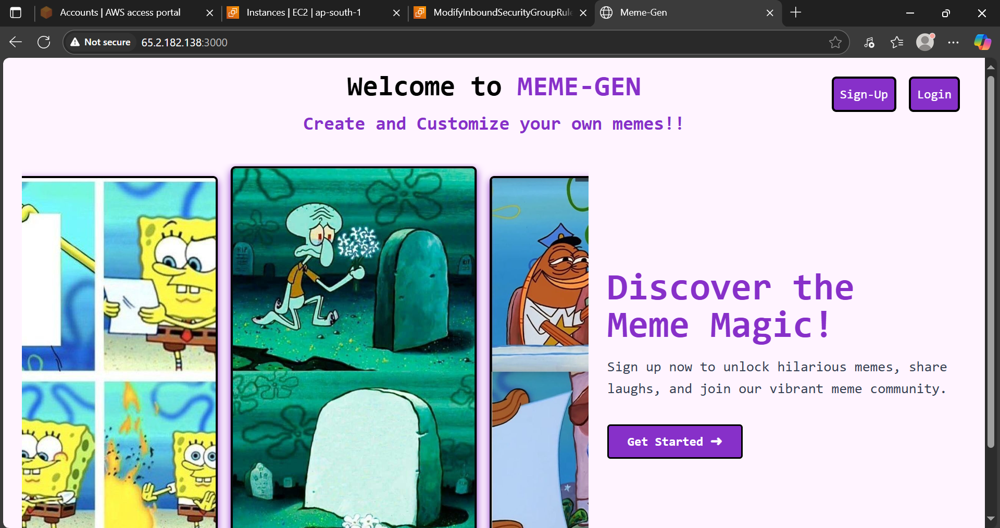

# 🚀 Deploying React App to EC2 Using Docker

This guide demonstrates the complete process of containerizing a React application using Docker and deploying it to an AWS EC2 instance.

---

## 📦 1. Creating the Dockerfile

We begin by defining our application's Docker configuration.

  

---

## 🧪 2. Running the Container Locally

Before deployment, we test the container locally to ensure the image works as expected.

  

---

## 🌐 3. Verifying on Localhost

Check that the application is running correctly on your local machine.

  

---

## 🛠️ 4. Setting Up the EC2 Instance

Launch an EC2 instance and configure the **inbound rules** to allow web traffic (typically on port 80 or 8080).

  

---

## 🔐 5. SSH into EC2 and Install Docker

Connect to your EC2 instance and install Docker to enable container execution.

  

---

## 🧱 6. Running the Container on EC2

Run your Docker container on the EC2 instance using the previously built image.

  

---

## 🌍 7. Website Live on EC2 Public IP

Your React application is now accessible via the public IP of your EC2 instance.

  

---

> ✅ **Tip**: Make sure the port you're exposing in the Dockerfile (`EXPOSE`) and the one in the EC2 security group match (e.g., port `8080`).
